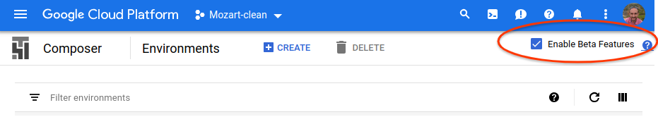
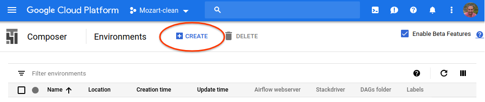
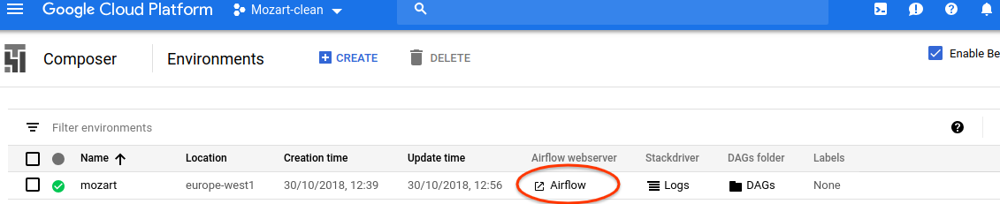
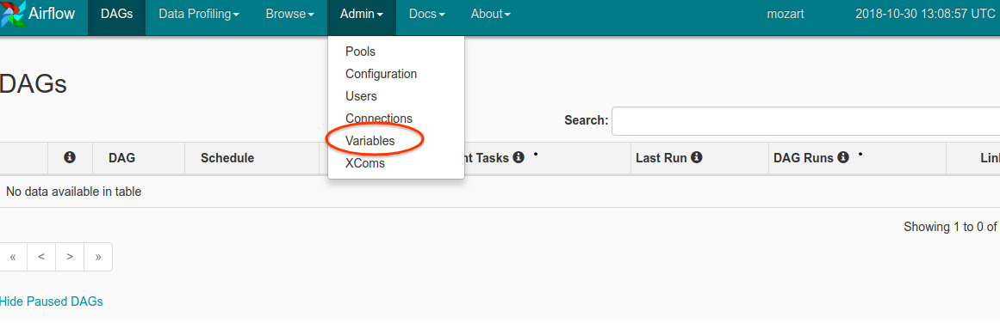
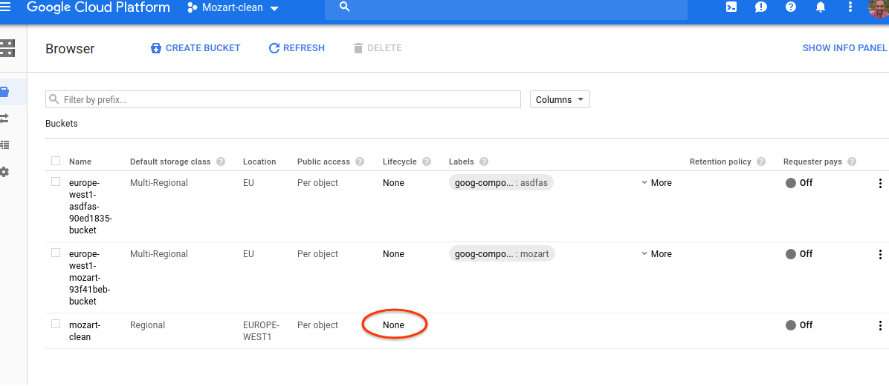

# Mozart - Business logic for Search Ads 360

Table of Contents
=================

  * [How it works](#how-it-works)
  * [Architecture](#architecture)
  * [Set-up](#set-up)
     * [Pre-requisites](#pre-requisites)
     * [Composer set-up](#composer-set-up)
  * [DataFlow set-up](#dataflow-set-up)
  * [Cloud Storage set-up](#cloud-storage-set-up)

Mozart is a framework for automating tasks on Search Ads 360 (SA360). Mozart
lets advertisers and agencies apply their own business logic to SA360 campaigns
by leveraging well-known technologies such as Apache Beam.

Mozart is designed to be deployed in an Airflow+Beam platform. The rest of this
documentation assumes Google Cloud Platform (GCP) is used for deployment.
*Composer* is the name of GCP's managed version of *Airflow*, whereas *DataFlow*
is the name of the managed version of *Beam*.

## How it works

Mozart leverages SA360 Reporting API and SA360 Bulksheet uploads to perform the
automation tasks.

The sequence of high-level operations is:

1.  Reports are downloaded from SA360 API. These reports must include all
    entities to be processed (e.g.: Keywords, Ads).
2.  Downloaded reports are analyzed, applying the custom business logic. The
    output of this logic is a CSV file containing updated information about the
    entities (Keywords, Ads). For example: a new Max CPC value for certain
    keywords
3.  CSV files with updated values are uploaded into SA360 using sFTP Bulksheet
    upload

## Architecture

Mozart consists of two main modules:

1.  An Airflow DAG
2.  A Beam Pipeline

## Set-up

This guide describes how to set-up Mozart on Google Cloud Platform.

For the rest of the guide, it is assumed that you have created a Google Cloud
project, enabled billing and that you have Admin access to the project via
[console.cloud.google.com](https://console.cloud.google.com/).

For instructions on how to create a Google Cloud project and enable billing
please refer to
[Google Cloud Platform documentation](https://cloud.google.com/resource-manager/docs/creating-managing-projects).

You must also enable certain Google Cloud Platform APIs to be able to use
Mozart. In order to enable all of them in a single step, click on
[enable APIs](https://console.cloud.google.com/flows/enableapi?apiid=composer.googleapis.com,dataproc.googleapis.com,storage-component.googleapis.com,dataflow,compute_component,logging,storage_component,storage_api,bigquery,pubsub,datastore.googleapis.com,cloudresourcemanager.googleapis.com,doubleclicksearch)
and follow the instructions.

Note: The link to enable APIs might take a while to load. Please be patient.

### Pre-requisites

You must have the following software installed on your computer:

*   [Google Cloud SDK](https://cloud.google.com/sdk/install)
*   [Apache Maven](https://maven.apache.org/)

### Composer set-up

First step is to set-up Google Cloud Composer. In order to do so, follow the
steps:

1.  Create a new Composer environment

    1.  Go to
        [console.cloud.google.com/composer](https://console.cloud.google.com/composer)
    1.  Check 'Enable beta features'

        

    1.  Click on 'Create'

        

    1.  Type in the following options:

        *   Name: Enter a descriptive name
        *   Location: select a location close to you (e.g.: 'europe-west1)
        *   Scopes:
            *   https://www.googleapis.com/auth/bigquery
            *   https://www.googleapis.com/auth/devstorage.read_write
            *   https://www.googleapis.com/auth/doubleclicksearch
            *   https://www.googleapis.com/auth/compute
            *   https://www.googleapis.com/auth/cloud-platform
        *   Disk size: 20
        *   Airflow version: 1.10.0

    1.  Click on 'Create' at the bottom of the page

    Tip: Creating the environment takes a while. We suggest you to continue with
    the other sections and come back later to finish environment configuration.

1.  Once the environment is created, go to the
    [Composer page](https://console.cloud.google.com/composer) and open the
    'Airflow webserver' for the newly created environment.

    

1.  Click on 'Admin' > 'Variables'

    

1.  Create the following variables:

Variable                 | Description                                                                                                                                                                                                                                                                                                                                                                                                         | Example value
------------------------ | ------------------------------------------------------------------------------------------------------------------------------------------------------------------------------------------------------------------------------------------------------------------------------------------------------------------------------------------------------------------------------------------------------------------- | -------------
mozart/sa360_agency_id   | SA360 agency ID                                                                                                                                                                                                                                                                                                                                                                                                     | 123456789
mozart/start_date        | Enter today's date                                                                                                                                                                                                                                                                                                                                                                                                  | 2018-10-30
mozart/lookback_days     | Number of days back to pull reports for. E.g.: if you enter '7', you will work with data (clicks, impressions) from the last 7 days                                                                                                                                                                                                                                                                                 | 7
mozart/gcp_project       | Your Google Cloud project ID                                                                                                                                                                                                                                                                                                                                                                                        | mozart-123456
mozart/gcp_zone          | The zone of your Composer instance                                                                                                                                                                                                                                                                                                                                                                                  | europe-west1-b
mozart/gcs_bucket        | Name of the GCS bucket you created (without 'gs://' prefix)                                                                                                                                                                                                                                                                                                                                                         | mozart-data
mozart/dataflow_staging  | GCS URI for DataFlow staging folder                                                                                                                                                                                                                                                                                                                                                                                 | gs://mozart/staging
mozart/dataflow_template | GCS URI for DataFlow template                                                                                                                                                                                                                                                                                                                                                                                       | gs://mozart/templates/MozartProcessElements
mozart/advertisers       | JSON describing the advertisers to work with. Each advertiser contains an entry with the *advertiserId* and information about the sFTP endpoint for that advertiser. sFTP enpoint connection must specify either a *sftpConnId* or the sFTP connection parameters: *sftpHost*, *sftpPort*, *sftpUsername*, *sftpPassword*. Any of these individual fields overrides the configuration provided in the connection ID | \[{"advertiserId": "123", "sftpConnId": "sa360_sftp", "sftpUsername": "username1", "sftpPassword": "password1"},{"advertiserId": "456", "sftpConnId": "sa360_sftp", "sftpUsername": "username2", "sftpPassword": "password2"} \]

## DataFlow set-up

1.  Create a Service account
    1.  In the GCP Console, go to the
        [Create service account key page](https://console.cloud.google.com/apis/credentials/serviceaccountkey?_ga=2.117905545.-183250881.1540540997).
    1.  From the Service account drop-down list, select 'New service account'.
    1.  In the Service account name field, enter a name .
    1.  From the Role drop-down list, select 'Project > Owner'
        *   Use 'Project > Owner' for testing purposes. For a production system,
            you should select a more restrictive role.
    1.  Click 'Create'. A JSON file that contains your key downloads to your
        computer.
1.  Set the environment variable GOOGLE_APPLICATION_CREDENTIALS to the absolute
    path of the JSON file downloaded in the previous step

## Cloud Storage set-up

Mozart's DataFlow pipeline works with files on Google Cloud Storage. You need to
create a bucket where these files will be stored:

1.  Go to
    [console.cloud.google.com/storage](https://console.cloud.google.com/storage)
1.  Create a bucket

    1.  Click on 'Create bucket'
    1.  Choose a name for the bucket
    1.  Choose a location that matches the location you used for the Composer
        configuration

        Note: A configuration based on 'Regional' storage class and the same
        location as the one used for Composer is suggested. However, you may
        want to use other options if you plan on using the bucket for storing
        custom data. Check the Cloud Storage docs for more info on all the
        options.

1.  Create a lifecycle rule for the bucket

    1.  In the bucket list view, click on the Lifecycle column value

        

    1.  Click on 'Add rule'

    1.  Select 'Age' condition, and set it to 30 days

    1.  As an action, select 'Delete'

    1.  Save the rule

    Note: Lifecycle rules help you decrease Cloud Storage costs by deleting old
    elements. We suggest setting this 30-day policy, but you should adjust this
    if you wish to keep items for longer, or if you plan on storing other data
    in the same bucket.

1.  Create the following folders:

    1.  staging
    1.  templates
    1.  sa360_reports
    1.  sa360_upload
